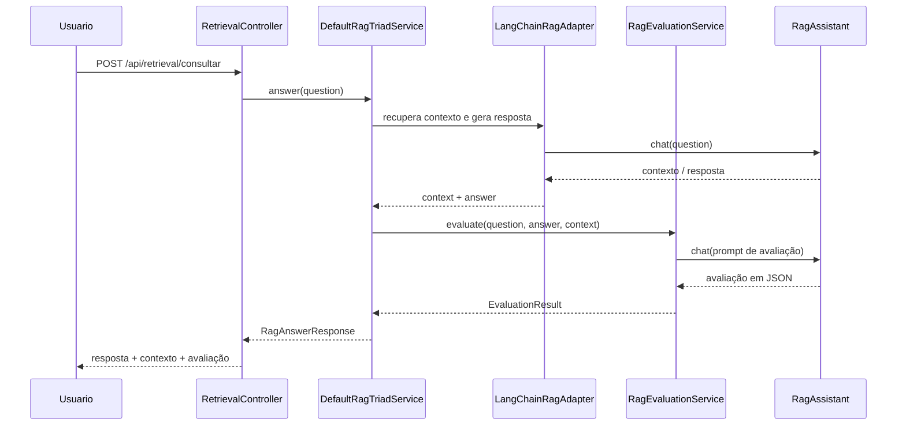

# Diagrama de sequência do processo de avaliação RAG

```mermaid
sequenceDiagram
    participant Usuario
    participant Controller as RetrievalController
    participant Triad as DefaultRagTriadService
    participant Adapter as LangChainRagAdapter
    participant Evaluation as RagEvaluationService
    participant LLM as RagAssistant

    Usuario->>Controller: POST /api/retrieval/consultar
    Controller->>Triad: answer(question)

    Triad->>Adapter: recupera contexto e gera resposta
    Adapter->>LLM: chat(question)
    LLM-->>Adapter: contexto / resposta
    Adapter-->>Triad: context + answer

    Triad->>Evaluation: evaluate(question, answer, context)
    Evaluation->>LLM: chat(prompt de avaliação)
    LLM-->>Evaluation: avaliação em JSON

    Evaluation-->>Triad: EvaluationResult
    Triad-->>Controller: RagAnswerResponse
    Controller-->>Usuario: resposta + contexto + avaliação
```
