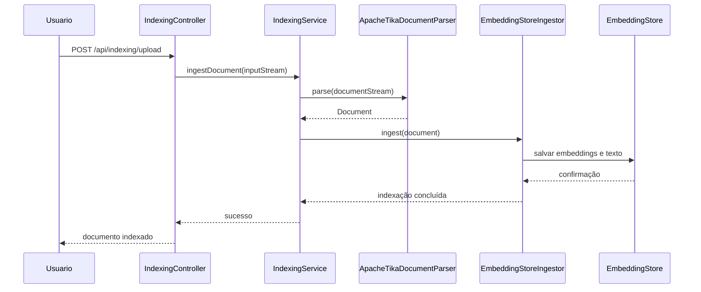

# Diagrama de sequência da fase de indexação do RAG

```mermaid
sequenceDiagram
    participant Usuario
    participant Controller as IndexingController
    participant Service as IndexingService
    participant Parser as ApacheTikaDocumentParser
    participant Ingestor as EmbeddingStoreIngestor
    participant Store as EmbeddingStore

    Usuario->>Controller: POST /api/indexing/upload
    Controller->>Service: ingestDocument(inputStream)
    Service->>Parser: parse(documentStream)
    Parser-->>Service: Document
    Service->>Ingestor: ingest(document)
    Ingestor->>Store: salvar embeddings e texto
    Store-->>Ingestor: confirmação
    Ingestor-->>Service: indexação concluída
    Service-->>Controller: sucesso
    Controller-->>Usuario: documento indexado
```
